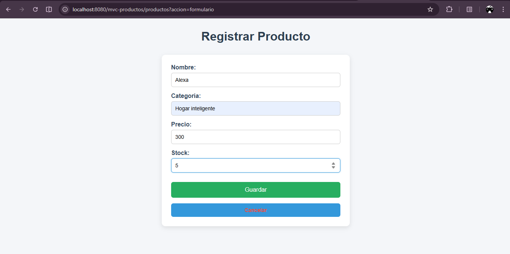
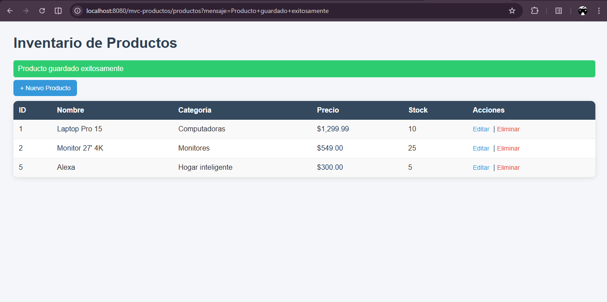

# CRUD de Productos con MVC (Java Web)

## 📖 Descripción del Proyecto
Aplicación web en Java que implementa el patrón MVC utilizando Servlets, JSP, JSTL y Expression Language.  
Permite gestionar un inventario de productos mediante operaciones CRUD (Crear, Listar, Editar y Eliminar).  
Se implementa el patrón Post/Redirect/Get para evitar reenvíos de formularios.

---

## 🛠️ Prerrequisitos
- JDK 11 o superior  
- Apache Tomcat 9 o superior  
- Maven  
- IDE (IntelliJ o Eclipse)  

---

## ⚙️ Ejecución

1. Compilar el proyecto:
   mvn clean package

2. Desplegar en Tomcat:
   Copiar el archivo .war desde:
   target/catalogo-web-1.0-SNAPSHOT.war

3. Ejecutar Tomcat y acceder a:
   http://localhost:8080/catalogo-web/productos

---

## 🚀 Funcionalidades
- Listado de productos
- Registro de productos
- Edición de productos
- Eliminación con confirmación
- Uso de JSTL y EL
- Patrón MVC correctamente aplicado

---

## 📸 Capturas

### Listado

### Formulario

### Agregar y Eliminar un producto
